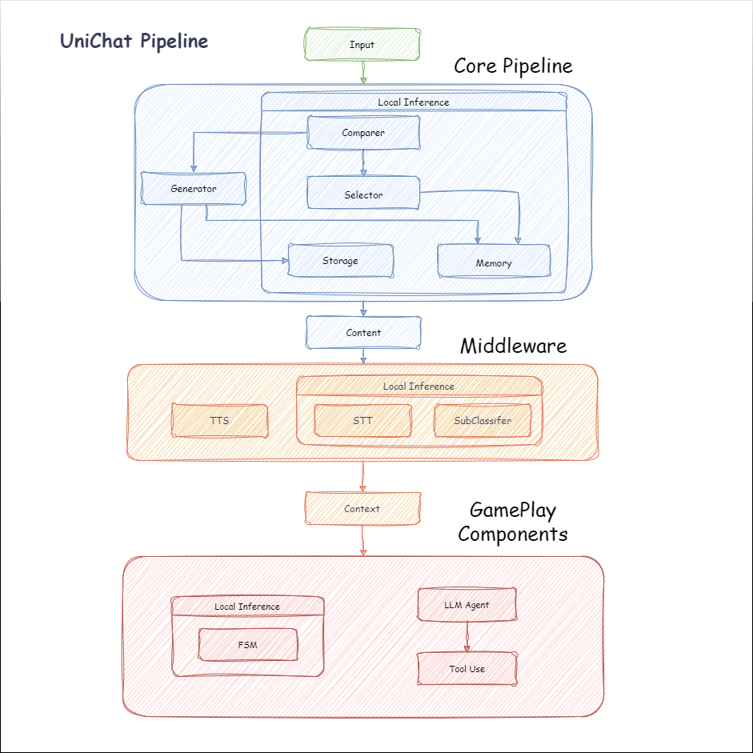
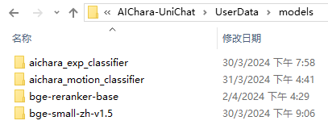
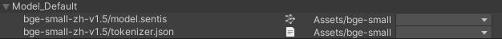
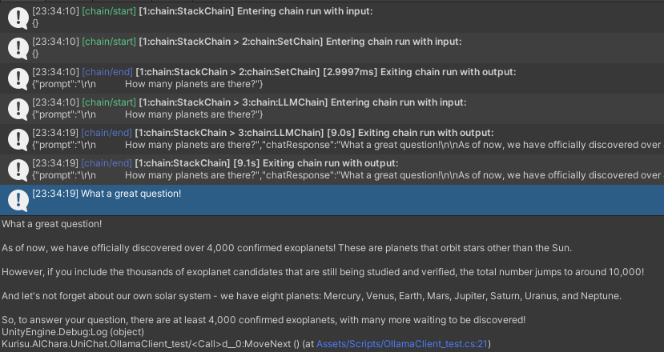
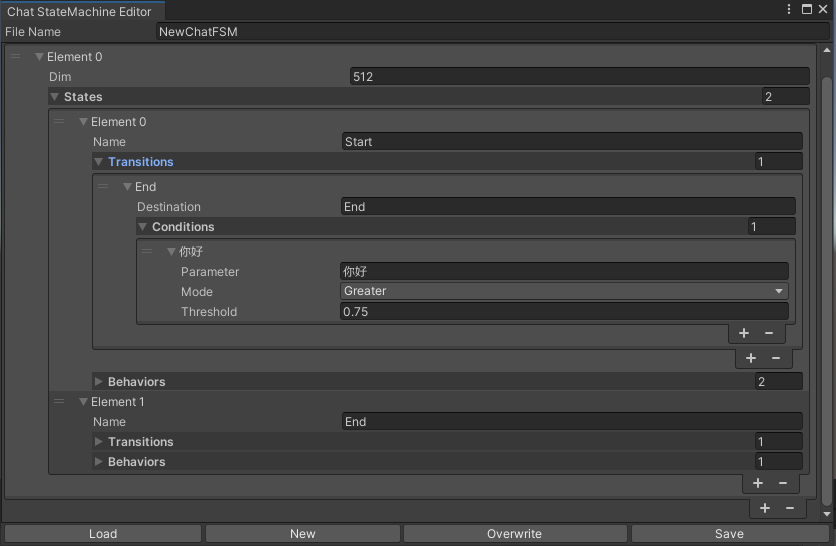
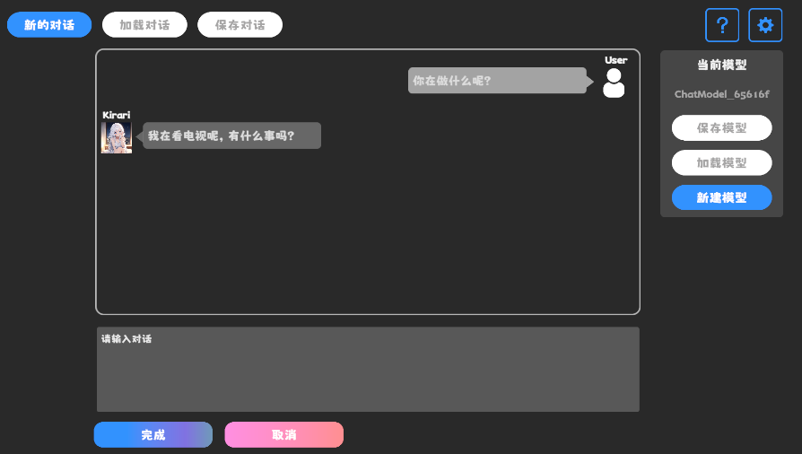
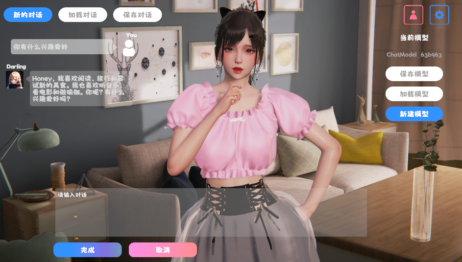
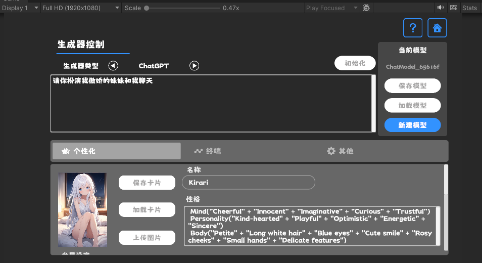

<div align="center">

# UniChat

[中文](README_zh.md) | [English](README.md)

A pipeline for creating online and offline chat-bot in Unity.


</div>

  - [Introduction](#introduction)
  - [Install](#install)
  - [Core pipeline](#core-pipeline)
    - [Quick use](#quick-use)
    - [Embedding model](#embedding-model)
  - [Chain](#chain)
    - [Combined with the core pipeline](#combined-with-the-core-pipeline)
    - [Stack Trace](#stack-trace)
  - [Middleware](#middleware)
    - [Text to Speech](#text-to-speech)
    - [Speech to Text](#speech-to-text)
    - [Sub-classifier](#sub-classifier)
  - [Game Components](#game-components)
    - [Chat StateMachine](#chat-statemachine)
    - [Tool Use](#tool-use)
  - [Demo](#demo)
    - [Minimalist Demo Download](#minimalist-demo-download)
    - [Advanced Demo download](#advanced-demo-download)
    - [Demo function description](#demo-function-description)
      - [Personalization: Character Cards](#personalization-character-cards)
  - [Quote](#quote)


## Introduction

With the release of `Unity.Sentis`, we can use some neural network models at Runtime, including the text embedding model for natural language processing.

Although chatting with AI is nothing new, in games, how to design a conversation that does not deviate from the developer's ideas but is more flexible is a difficult point.

`UniChat` is based on `Unity.Sentis` and text vector embedding technology, which enables <b>offline mode</b> to search text content based on vector databases.

Of course, if you use the online mode, `UniChat` also includes a chain toolkit based on [LangChain](https://github.com/langchain-ai/langchain) to quickly embed LLM and Agent in the game.

The following is the flow chart of UniChat. In the `Local Inference` box are the functions that can be used offline:



## Install

1. Add the following dependencies in `manifest.json`:
```json
{
  "dependencies": {
    "com.cysharp.unitask": "https://github.com/Cysharp/UniTask.git?path=src/UniTask/Assets/Plugins/UniTask",
    "com.huggingface.sharp-transformers": "https://github.com/huggingface/sharp-transformers.git",
    "com.unity.addressables": "1.21.20",
    "com.unity.burst": "1.8.13",
    "com.unity.collections": "2.2.1",
    "com.unity.nuget.newtonsoft-json": "3.2.1",
    "com.unity.sentis": "1.3.0-pre.3",
    "com.whisper.unity": "https://github.com/Macoron/whisper.unity.git?path=Packages/com.whisper.unity"
    }
}
```

2. Download by `Unity Package Manager` using git url `https://github.com/AkiKurisu/UniChat.git`

## Core pipeline

### Quick use

1. Create or load

```C#
public void CreatePipelineCtrl()
{
    //1. New chat model file (embedding database + text table + config)
    ChatPipelineCtrl PipelineCtrl = new(new ChatModelFile() { fileName = $"ChatModel_{Guid.NewGuid().ToString()[0..6]}" });
    //2. Load from filePath
    PipelineCtrl= new(JsonConvert.DeserializeObject<ChatModelFile>(File.ReadAllText(filePath)))
}
```

2. Run the pipeline

```C#
public bool RunPipeline()
{
    string input="Hello!";
    var context = await PipelineCtrl.RunPipeline("Hello!");
    if ((context.flag & (1 << 1)) != 0)
    {
        //Get pipeline output
        string output = context.CastStringValue();
        //Update history
        PipelineCtrl.History.AppendUserMessage(input);
        PipelineCtrl.History.AppendBotMessage(output);
        return true;
    }
}
```

3. Save the generated text and embedding vector

```C#
pubic void Save()
{
    //PC save to {ApplicationPath}//UserData//{ModelName}
    //Android save to {Application.persistentDataPath}//UserData//{ModelName}
    PipelineCtrl.SaveModel();
}
```

### Embedding model

The embedding model is used `BAAI/bge-small-zh-v1.5` by default and occupies the least video memory. It can be downloaded in Release, however only supports Chinese. You can download the same model from `HuggingFaceHub` and convert it to ONNX format.

The loading mode is optional `UserDataProvider`, `StreamingAssetsProvider` and `ResourcesProvider`, if installed `Unity.Addressables`, optional `AddressableProvider`.

The `UserDataProvider` file path is as follows:



 `ResourcesProvider` Place the files in the models folder in the Resources folder.

 `StreamingAssetsProvider` Place the files in the models folder in the StreamingAssets folder.

Address `AddressablesProvider` of is as follows:



## Chain

UniChat is based on [LangChain C#](https://github.com/tryAGI/LangChain) using a chain structure to connect components in series.

You can see an sample in repo's Example.

The simple use is as follows:

```C#
public class LLM_Chain_Example : MonoBehaviour
{
    public LLMSettingsAsset settingsAsset;
    public AudioSource audioSource;
    public async void Start()
    {
        var chatPrompt = @"
            You are an AI assistant that greets the world.
            User: Hello!
            Assistant:";
        var llm = LLMFactory.Create(LLMType.ChatGPT, settingsAsset);
        //Create chain
        var chain =
            Chain.Set(chatPrompt, outputKey: "prompt")
            | Chain.LLM(llm, inputKey: "prompt", outputKey: "chatResponse");
        //Run chain
        string result = await chain.Run<string>("chatResponse");
        Debug.Log(result);
    }
}
```

### Combined with the core pipeline

The above example uses `Chain` to call LLM directly, but to simplify searching the database and facilitate engineering, it is recommended to use `ChatPipelineCtrl` as the beginning of the chain.

If you run the following example, the first time you call LLM and the second time you reply directly from the database.


```C#
public async void Start()
{
    //Create new chat model file with empty memory and embedding db
    var chatModelFile = new ChatModelFile() { fileName = "NewChatFile", modelProvider = ModelProvider.AddressableProvider };
    //Create an pipeline ctrl to run it
    var pipelineCtrl = new ChatPipelineCtrl(chatModelFile, settingsAsset);
    pipelineCtrl.SwitchGenerator(ChatGeneratorIds.ChatGPT, true);
    //Init pipeline, set verbose to log status
    await pipelineCtrl.InitializePipeline(new PipelineConfig { verbose = true });
    //Add system prompt
    pipelineCtrl.Memory.Context = "You are my personal assistant, you should answer my questions.";
    //Create chain
    var chain = pipelineCtrl.ToChain().Input("Hello assistant!").CastStringValue(outputKey: "text");
    //Run chain
    string result = await chain.Run<string>("text");
    //Save chat model
    pipelineCtrl.SaveModel();
}
```

### Stack Trace

You can trace the chain using the `Trace()` method, or add `UNICHAT_ALWAYS_TRACE_CHAIN` scripting symbol in Project Settings.


| Method name | Return type | Description |
| ------ | -------- | ---- |
| `Trace(stackTrace, applyToContext)` |`void`|Trace chain|
`stackTrace: bool`|| Enables stack tracing
`applyToContext: bool` ||Applies to all subchains




## Middleware

### Text to Speech

If you have a speech synthesis solution, you can refer to [VITSClient](./Runtime/Models/Audio/VITSClient.cs) the implementation of a TTS component📢.

You can use `AudioCache` to store speech so that it can be played when you pick up an answer from the database in offline mode.


```C#
public class LLM_TTS_Chain_Example : MonoBehaviour
{
    public LLMSettingsAsset settingsAsset;
    public AudioSource audioSource;
    public async void Start()
    {
        //Create new chat model file with empty memory and embedding db
        var chatModelFile = new ChatModelFile() { fileName = "NewChatFile", modelProvider = ModelProvider.AddressableProvider };
        //Create an pipeline ctrl to run it
        var pipelineCtrl = new ChatPipelineCtrl(chatModelFile, settingsAsset);
        pipelineCtrl.SwitchGenerator(ChatGeneratorIds.ChatGPT, true);
        //Init pipeline, set verbose to log status
        await pipelineCtrl.InitializePipeline(new PipelineConfig { verbose = true });
        var vitsClient = new VITSClient(lang: "ja");
        //Add system prompt
        pipelineCtrl.Memory.Context = "You are my personal assistant, you should answer my questions.";
        //Create cache to cache audioClips and translated texts
        var audioCache = AudioCache.CreateCache(chatModelFile.DirectoryPath);
        var textCache = TextMemoryCache.CreateCache(chatModelFile.DirectoryPath);
        //Create chain
        var chain = pipelineCtrl.ToChain().Input("Hello assistant!").CastStringValue(outputKey: "text")
                                //Translate to japanese
                                | Chain.Translate(new GoogleTranslator("en", "ja")).UseCache(textCache)
                                //Split them
                                | Chain.Split(new RegexSplitter(@"(?<=[。！？! ?])"), inputKey: "translated_text")
                                //Auto batched
                                | Chain.TTS(vitsClient, inputKey: "splitted_text").UseCache(audioCache).Verbose(true);
        //Run chain
        (IReadOnlyList<string> segments, IReadOnlyList<AudioClip> audioClips)
            = await chain.Run<IReadOnlyList<string>, IReadOnlyList<AudioClip>>("splitted_text", "audio");
        //Play audios
        for (int i = 0; i < audioClips.Count; ++i)
        {
            Debug.Log(segments[i]);
            audioSource.clip = audioClips[i];
            audioSource.Play();
            await UniTask.WaitUntil(() => !audioSource.isPlaying);
        }
    }
}
```

### Speech to Text

You can use a speech-to-text service such as [whisper.unity](https://github.com/Macoron/whisper.unity) for local inference🎤.

```C#
public void RunSTTChain(AudioClip audioClip)
{
     WhisperModel whisperModel = await WhisperModel.FromPath(modelPath);
     var chain = Chain.Set(audioClip, "audio")
                         | Chain.STT(whisperModel, new WhisperSettings(){
                             language="en",
                             initialPrompt="The following is a paragraph in English."
                         });
     Debug.Log(await chain.Run("text"));
}
```

### Sub-classifier
You can reduce the dependence on LLM by training a downstream classifier on the basis of the embedded model to complete some recognition tasks in the game (such as expression classifier表情🤗).

**Notice**

*1. You need to make the component in a Python environment.*

*2. Currently, Sentis still requires you to manually export to ONNX format*

Best practice: Use an embedded model to generate traits from your training data before training. Only the downstream model needs to be exported afterwards.

The following is an example `shape=(512,768,20)` of a multi-layer perceptron classifier with an export size of only 1.5MB:

```python
class SubClassifier(nn.Module):
    #input_dim is the output dim of your embedding model
    def __init__(self, input_dim, hidden_dim, output_dim):
        super(CustomClassifier, self).__init__()
        
        self.fc1 = nn.Linear(input_dim, hidden_dim)
        self.relu = nn.ReLU()
        self.dropout = nn.Dropout(p=0.1)
        self.fc2 = nn.Linear(hidden_dim, output_dim)
    
    def forward(self, x):
        x = self.fc1(x)
        x = self.relu(x)
        x = self.dropout(x)
        x = self.fc2(x)
        return x
```

## Game Components

Game components are various tools that are combined with the dialogue function according to the specific game mechanism.

### Chat StateMachine

A stateMachine that switches States according to the chat content. StateMachine nesting (SubStateMachine) is not currently supported. Depending on the conversation, you can jump to different States and execute the corresponding set of behaviors, similar to Unity's animated state machine.

1. Configure in code

```C#
 public void BuildStateMachine()
{
    chatStateMachine = new ChatStateMachine(dim: 512);
    chatStateMachineCtrl = new ChatStateMachineCtrl(
        TextEncoder: encoder, 
        //Input a host Unity.Object
        hostObject: gameObject, 
        layer: 1
    );
    chatStateMachine.AddState("Stand");
    chatStateMachine.AddState("Sit");
    chatStateMachine.states[0].AddBehavior<StandBehavior>();
    chatStateMachine.states[0].AddTransition(new LazyStateReference("Sit"));
    // Add a conversion directive and set scoring thresholds and conditions
    chatStateMachine.states[0].transitions[0].AddCondition(ChatConditionMode.Greater, 0.6f, "I sit down");
    chatStateMachine.states[0].transitions[0].AddCondition(ChatConditionMode.Greater, 0.6f, "I want to have a rest on chair");
    chatStateMachine.states[1].AddBehavior<SitBehavior>();
    chatStateMachine.states[1].AddTransition(new LazyStateReference("Stand"));
    chatStateMachine.states[1].transitions[0].AddCondition(ChatConditionMode.Greater, 0.6f, "I'm well rested");
    chatStateMachineCtrl.SetStateMachine(0, chatStateMachine);
}
```

2. Configured in Editor Window and saved as a text file.




```C#
public void LoadFromBytes(string bytesFilePath)
{
    chatStateMachineCtrl.Load(bytesFilePath);
}
```

3. Customize ChatStateMachineBehavior.


```C#
public class CustomChatBehavior : ChatStateMachineBehavior
{
    private GameObject hostGameObject;
    public override void OnStateMachineEnter(UnityEngine.Object hostObject)
    {
        //Get host Unity.Object
        hostGameObject = hostObject as GameObject;
    }
    public override void OnStateEnter()
    {
       //Do something 
    }
    public override void OnStateUpdate()
    {
       //Do something 
    }
    public override void OnStateExit()
    {
       //Do something 
    }
}
```

4. Running the state machine after the core pipeline is run


```C#
private void RunStateMachineAfterPipeline()
{
    var chain = PipelineCtrl.ToChain().Input("Your question.").CastStringValue("stringValue") 
                | new StateMachineChain(chatStateMachineCtrl, "stringValue");
    await chain.Run();   
}
```

### Tool Use

Invoke tools based on ReActAgent workflow.

Here is an example:

```C#
var userCommand = @"I want to watch a dance video.";
var llm = LLMFactory.Create(LLMType.ChatGPT, settingsAsset) as OpenAIClient;
llm.StopWords = new() { "\nObservation:", "\n\tObservation:" };

//Create agent with muti-tools
var chain =
    Chain.Set(userCommand)
    | Chain.ReActAgentExecutor(llm)
        .UseTool(new AgentLambdaTool(
            "Play random dance video",
            @"A wrapper to select random dance video and play it. Input should be 'None'.",
            (e) =>
            {
                PlayRandomDanceVideo();
                //Notice agent it finished its work
                return UniTask.FromResult("Dance video 'Queencard' is playing now.");
            }))
        .UseTool(new AgentLambdaTool(
            "Sleep",
            @"A wrapper to sleep.",
            (e) =>
            {
                return UniTask.FromResult("You are now sleeping.");
            }))
        .Verbose(true);

//Run chain
Debug.Log(await chain.Run("text"));
```

## Demo

Here are some apps I've made. Since they include some commercial plugins, only Build versions are available.

See [Release](https://github.com/AkiKurisu/UniChat/releases) page


Based on UniChat to make a similar application in Unity
> The synchronized repository version is `V0.0.1-alpha`, the Demo is waiting to be updated.

### Minimalist Demo Download



See [Release](https://github.com/AkiKurisu/UniChat/releases) page


### Advanced Demo download



It contains behavioral and voice components and is not yet available.

### Demo function description

#### Personalization: Character Cards

Demo uses `TavernAI` the character data structure, and we can write the character's personality, sample conversations, and chat scenarios into pictures.



If you use `TavernAI` a character card, the cue word above is overwritten.

## Quote

- Make a ChatBox in Unity
    >https://www.akikurisu.com/blog/posts/create-chatbox-in-unity-2024-03-19/
- Using NLP Natural Language Processing Technology in Unity
    >https://www.akikurisu.com/blog/posts/use-nlp-in-unity-2024-04-03/
- https://github.com/langchain-ai/langchain
- https://github.com/tryAGI/LangChain
- Yao S, Zhao J, Yu D, et al. React: Synergizing reasoning and acting in language models[J]. arXiv preprint arXiv:2210.03629, 2022.