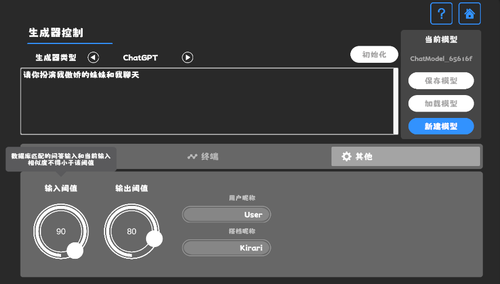

# UniChat

一个基于文本向量嵌入的Unity Chat-Bot管线。

## 构想

随着`Unity.Sentis`的发布，我们可以在Runtime使用一些神经网络模型，其中就包括自然语言处理的文本向量嵌入模型（Text Embedding Model）。

虽然和AI聊天已经不是新鲜事了，但在游戏中，如何设计一个能不偏离开发者想法，但又比较灵活的对话倒是一个难点。

我认为文本向量嵌入有助于这个问题得以解决，例如用户输入对话后，可以通过模型将对话文本向量化，再通过<b>余弦相似度</b>从数据库中计算得到合适的对话内容。

因此，我们可以在使用大语言模型生成足够多的文本后，在游戏中基于向量数据库来搜索文本，这样就不需要依赖Web API了。

详情可见：
- 在Unity中制作一个ChatBox https://www.akikurisu.com/blog/posts/create-chatbox-in-unity-2024-03-19/
- 在Unity中使用NLP自然语言处理技术 https://www.akikurisu.com/blog/posts/use-nlp-in-unity-2024-04-03/

## 原理

余弦相似度公式: 

$$
\text{similarity} = \frac{{\mathbf{A} \cdot \mathbf{B}}}{{\|\mathbf{A}\| \|\mathbf{B}\|}}
$$

以下是Chat-Bot的流程图：

## 流程

具体流程如下：
1. 用户输入文本
2. 模型转为向量
3. 管线在数据库中比较，选择是否使用生成器或选择器
4. 如使用选择器，则由选择器从数据库中拾取合适的回答
5. 如使用生成器，则由生成器根据上下文生成回答并导入数据库中
6. 显示回答

## Demo下载

见Release页面

## Demo介绍

基于UniChat在Unity中制作了一个类似`ChatBox`的应用。

### 插件引用
基本所有的AI对话应用都是聊天界面，我使用了一些插件用来在Unity里快速实现这些界面。

CleanFlatUI 一个简洁包括动画效果的UI套件。
>https://assetstore.unity.com/packages/2d/gui/icons/super-clean-ui-flat-pack-244547

SuperScrollView 一个高性能的滚动界面套件。
>https://assetstore.unity.com/packages/tools/gui/ugui-super-scrollview-86572

UniWindowController 用于拖拽文件、打开文件浏览器的插件。
>https://github.com/kirurobo/UniWindowController

### 个性化：角色卡

这里使用`TavernAI`的角色数据结构，并且我们可以将角色的性格、示例对话、聊天情景写入图片中。

设置界面

如果使用`TavernAI`角色卡，则会覆盖上面的提示词。

### 设置阈值

提供一个界面用来设置上面`Filter`所需的两个参数用以过滤和判别是否启用生成器

设置阈值

### 聊天界面

聊天界面就是输入框+按钮+滚动界面

聊天界面

