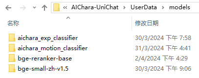

<div align="center">

# UniChat

[中文](README_zh.md) | [English](README.md)

一在Unity中创建在线和离线时chat-bot的管线。


</div>

  - [简介](#简介)
  - [安装](#安装)
  - [核心管线](#核心管线)
    - [快速使用](#快速使用)
    - [嵌入模型](#嵌入模型)
  - [链](#链)
    - [与核心管线组合](#与核心管线组合)
    - [堆栈跟踪](#堆栈跟踪)
  - [中间件](#中间件)
    - [文本转语音](#文本转语音)
    - [语音转文本](#语音转文本)
    - [子分类器](#子分类器)
  - [游戏组件](#游戏组件)
    - [对话状态机](#对话状态机)
    - [工具使用](#工具使用)
  - [Demo](#demo)
    - [极简Demo下载](#极简demo下载)
    - [高级Demo下载](#高级demo下载)
    - [Demo功能说明](#demo功能说明)
      - [个性化：角色卡](#个性化角色卡)
  - [引用](#引用)


## 简介

随着`Unity.Sentis`的发布，我们可以在Runtime使用一些神经网络模型，其中就包括自然语言处理的文本向量嵌入模型(Text Embedding Model)。

虽然和AI聊天已经不是新鲜事了，但在游戏中，如何设计一个能不偏离开发者想法，但又比较灵活的对话倒是一个难点。

`UniChat`基于`Unity.Sentis`和文本向量嵌入技术使得<b>离线模式下</b>能基于向量数据库来搜索文本内容。

当然，如果你使用在线模式，`UniChat`也包含了一个基于[LangChain](https://github.com/langchain-ai/langchain)的链式工具包以快速在游戏中嵌入LLM和Agent。

以下是UniChat的流程图，在`Local Inference`框中的为可以离线使用的功能：


## 安装

1. 在`manifest.json`中添加以下依赖：
```json
{
  "dependencies": {
    "com.cysharp.unitask": "https://github.com/Cysharp/UniTask.git?path=src/UniTask/Assets/Plugins/UniTask",
    "com.huggingface.sharp-transformers": "https://github.com/huggingface/sharp-transformers.git",
    "com.unity.addressables": "1.21.20",
    "com.unity.burst": "1.8.13",
    "com.unity.collections": "2.2.1",
    "com.unity.nuget.newtonsoft-json": "3.2.1",
    "com.unity.sentis": "1.3.0-pre.3",
    "com.whisper.unity": "https://github.com/Macoron/whisper.unity.git?path=Packages/com.whisper.unity"
    }
}
```
2. 使用`Unity Package Manager`从git url下载 `https://github.com/AkiKurisu/UniChat.git`

## 核心管线

### 快速使用

1. 创建或加载
```C#
public void CreatePipelineCtrl()
{
    //1. 新对话模型（向量+文本+配置表）
    ChatPipelineCtrl PipelineCtrl = new(new ChatModelFile() { fileName = $"ChatModel_{Guid.NewGuid().ToString()[0..6]}" });
    //2. 从filePath加载
    PipelineCtrl= new(JsonConvert.DeserializeObject<ChatModelFile>(File.ReadAllText(filePath)))
}
```

2. 运行管线
```C#
public bool RunPipeline()
{
    string input="Hello!";
    var context = await PipelineCtrl.RunPipeline("Hello!");
    if ((context.flag & (1 << 1)) != 0)
    {
        //获取文本输出
        string output = context.CastStringValue();
        //更新历史
        PipelineCtrl.History.AppendUserMessage(input);
        PipelineCtrl.History.AppendBotMessage(output);
        return true;
    }
}
```

3. 保存生成的文本及嵌入向量
```C#
pubic void Save()
{
    //PC保存至 {ApplicationPath}//UserData//{ModelName}
    //Android保存至 {Application.persistentDataPath}//UserData//{ModelName}
    PipelineCtrl.SaveModel();
}
```

### 嵌入模型

嵌入模型默认使用`BAAI/bge-small-zh-v1.5`，占用显存内存最少。你可以在Release中下载，但其仅支持中文，你可以自行从`HuggingFaceHub`下载同类模型并转为ONNX格式。

加载方式可以选择`UserDataProvider`,`StreamingAssetsProvider`和`ResourcesProvider`，如安装`Unity.Addressables`可选`AddressableProvider`。

`UserDataProvider`文件路径如下:



`ResourcesProvider`则将models文件夹中的文件放入Resources文件夹即可。

`StreamingAssetsProvider`则将models文件夹中的文件放入StreamingAssets文件夹即可。

`AddressablesProvider`的Address如下:


## 链

UniChat基于[C#版LangChain](https://github.com/tryAGI/LangChain)使用链式结构串联各个组件。

你可以在Example中查看示例。

简单使用如下：
```C#
public class LLM_Chain_Example : MonoBehaviour
{
    public LLMSettingsAsset settingsAsset;
    public AudioSource audioSource;
    public async void Start()
    {
        var chatPrompt = @"
            You are an AI assistant that greets the world.
            User: 你好!
            Assistant:";
        var llm = LLMFactory.Create(LLMType.ChatGPT, settingsAsset);
        //Create chain
        var chain =
            Chain.Set(chatPrompt, outputKey: "prompt")
            | Chain.LLM(llm, inputKey: "prompt", outputKey: "chatResponse");
        //Run chain
        string result = await chain.Run<string>("chatResponse");
        Debug.Log(result);
    }
}
```

### 与核心管线组合

上面的例子是直接用Chain来调用LLM，但为了简化搜索数据库和方便工程化，推荐使用ChatPipelineCtrl作为链的开头。

如运行下面示例，第一次将调用LLM，第二次则直接从数据库中回复。

```C#
public async void Start()
{
    //Create new chat model file with empty memory and embedding db
    var chatModelFile = new ChatModelFile() { fileName = "NewChatFile", modelProvider = ModelProvider.AddressableProvider };
    //Create an pipeline ctrl to run it
    var pipelineCtrl = new ChatPipelineCtrl(chatModelFile, settingsAsset);
    pipelineCtrl.SwitchGenerator(ChatGeneratorIds.ChatGPT, true);
    //Init pipeline, set verbose to log status
    await pipelineCtrl.InitializePipeline(new PipelineConfig { verbose = true });
    //Add system prompt
    pipelineCtrl.Memory.Context = "You are my personal assistant, you should answer my questions.";
    //Create chain
    var chain = pipelineCtrl.ToChain().Input("Hello assistant!").CastStringValue(outputKey: "text");
    //Run chain
    string result = await chain.Run<string>("text");
    //Save chat model
    pipelineCtrl.SaveModel();
}
```

### 堆栈跟踪

你可以使用`Trace()`方法跟踪链，或者在Project Settings中添加宏`UNICHAT_ALWAYS_TRACE_CHAIN`。


| 方法名 | 返回类型 | 描述 |
| ------ | -------- | ---- |
| `Trace(stackTrace, applyToContext)` |`void`|跟踪链|
`stackTrace: bool`||启用堆栈跟踪
`applyToContext: bool` ||应用于所有子链 


## 中间件

### 文本转语音

如果你有语音合成方案,你可以参考[VITSClient](./Runtime/Models/Audio/VITSClient.cs)实现一个TTS组件📢。

你可以使用`AudioCache`来存储语音，这样在离线模式下从数据库拾取回答时也能播放语音。

```C#
public class LLM_TTS_Chain_Example : MonoBehaviour
{
    public LLMSettingsAsset settingsAsset;
    public AudioSource audioSource;
    public async void Start()
    {
        //Create new chat model file with empty memory and embedding db
        var chatModelFile = new ChatModelFile() { fileName = "NewChatFile", modelProvider = ModelProvider.AddressableProvider };
        //Create an pipeline ctrl to run it
        var pipelineCtrl = new ChatPipelineCtrl(chatModelFile, settingsAsset);
        pipelineCtrl.SwitchGenerator(ChatGeneratorIds.ChatGPT, true);
        //Init pipeline, set verbose to log status
        await pipelineCtrl.InitializePipeline(new PipelineConfig { verbose = true });
        var vitsClient = new VITSClient(lang: "ja");
         //Add system prompt
        pipelineCtrl.Memory.Context = "You are my personal assistant, you should answer my questions.";
        //Create cache to cache audioClips and translated texts
        var audioCache = AudioCache.CreateCache(chatModelFile.DirectoryPath);
        var textCache = TextMemoryCache.CreateCache(chatModelFile.DirectoryPath);
        //Create chain
        var chain = pipelineCtrl.ToChain().Input("Hello assistant!").CastStringValue(outputKey: "text")
                                //Translate to japanese
                                | Chain.Translate(new GoogleTranslator("zh", "ja")).UseCache(textCache)
                                //Split them
                                | Chain.Split(new RegexSplitter(@"(?<=[。！？! ?])"), inputKey: "translated_text")
                                //Auto batched
                                | Chain.TTS(vitsClient, inputKey: "splitted_text").UseCache(audioCache).Verbose(true);
        //Run chain
        (IReadOnlyList<string> segments, IReadOnlyList<AudioClip> audioClips)
            = await chain.Run<IReadOnlyList<string>, IReadOnlyList<AudioClip>>("splitted_text", "audio");
        //Play audios
        for (int i = 0; i < audioClips.Count; ++i)
        {
            Debug.Log(segments[i]);
            audioSource.clip = audioClips[i];
            audioSource.Play();
            await UniTask.WaitUntil(() => !audioSource.isPlaying);
        }
    }
}
```

### 语音转文本

你可以使用语音转文本服务，例如本地推理的[whisper.unity](https://github.com/Macoron/whisper.unity)🎤。

```C#
public void RunSTTChain(AudioClip audioClip)
{
    WhisperModel whisperModel = await WhisperModel.FromPath(modelPath);
    var chain = Chain.Set(audioClip, "audio")
                        | Chain.STT(whisperModel, new WhisperSettings(){
                            language="zh",
                            initialPrompt="以下是一段简体中文普通话。"
                        });
    Debug.Log(await chain.Run("text"));
}
```

### 子分类器
你可以在嵌入模型的基础上训练一个下游的分类器来完成一些游戏中的识别任务（例如表情分类器）从而减少对LLM的依赖🤗。

**注意**

*1.你需要在Python环境制作该组件*

*2.目前Sentis仍需你手动导出为ONNX格式*

最佳实践：先使用嵌入模型对你的训练数据生成特质再进行训练。之后只需导出下游模型即可。

下面是个多层感知机分类器示例，`shape=(512,768,20)`时导出大小仅为1.5MB：
```python
class SubClassifier(nn.Module):
    #输入dim为嵌入模型的输出特征dim
    def __init__(self, input_dim, hidden_dim, output_dim):
        super(CustomClassifier, self).__init__()
        
        self.fc1 = nn.Linear(input_dim, hidden_dim)
        self.relu = nn.ReLU()
        self.dropout = nn.Dropout(p=0.1)
        self.fc2 = nn.Linear(hidden_dim, output_dim)
    
    def forward(self, x):
        x = self.fc1(x)
        x = self.relu(x)
        x = self.dropout(x)
        x = self.fc2(x)
        return x
```

## 游戏组件

游戏组件是根据具体游戏机制来和对话功能进行结合的各类工具。

### 对话状态机

一个根据对话内容切换状态的状态机，暂不支持状态机嵌套（SubStateMachine）。你可以根据对话来跳转到不同的状态并执行相应的行为集合，类似于Unity的动画状态机。

1. 在代码中配置
```C#
 public void BuildStateMachine()
{
    chatStateMachine = new ChatStateMachine(dim: 512);
    chatStateMachineCtrl = new ChatStateMachineCtrl(
        TextEncoder: encoder, 
        //传入一个Unity.Object对象作为宿主
        hostObject: gameObject, 
        layer: 1
    );
    chatStateMachine.AddState("Stand");
    chatStateMachine.AddState("Sit");
    chatStateMachine.states[0].AddBehavior<StandBehavior>();
    chatStateMachine.states[0].AddTransition(new LazyStateReference("Sit"));
    // 添加一个转换的指令，并设置评分阈值以及条件
    chatStateMachine.states[0].transitions[0].AddCondition(ChatConditionMode.Greater, 0.6f, "我坐下了");
    chatStateMachine.states[0].transitions[0].AddCondition(ChatConditionMode.Greater, 0.6f, "我想在椅子上休息一会");
    chatStateMachine.states[1].AddBehavior<SitBehavior>();
    chatStateMachine.states[1].AddTransition(new LazyStateReference("Stand"));
    chatStateMachine.states[1].transitions[0].AddCondition(ChatConditionMode.Greater, 0.6f, "我休息完了");
    chatStateMachineCtrl.SetStateMachine(0, chatStateMachine);
}
```

2. 在EditorWindow中配置，保存为文本文件。


```C#
public void LoadFromBytes(string bytesFilePath)
{
    chatStateMachineCtrl.Load(bytesFilePath);
}
```

3. 自定义ChatStateMachineBehavior

```C#
public class CustomChatBehavior : ChatStateMachineBehavior
{
    private GameObject hostGameObject;
    public override void OnStateMachineEnter(UnityEngine.Object hostObject)
    {
        //获取宿主对象
        hostGameObject = hostObject as GameObject;
    }
    public override void OnStateEnter()
    {
       //Do something 
    }
    public override void OnStateUpdate()
    {
       //Do something 
    }
    public override void OnStateExit()
    {
       //Do something 
    }
}
```

4. 在核心管线运行后运行状态机

```C#
private void RunStateMachineAfterPipeline()
{
    var chain = PipelineCtrl.ToChain().Input("Your question.").CastStringValue("stringValue") 
                | new StateMachineChain(chatStateMachineCtrl, "stringValue");
    await chain.Run();   
}
```

### 工具使用

基于ReActAgent的工作流来调用工具。

以下是一个示例：

```C#
var userCommand = @"I want to watch a dance video.";
var llm = LLMFactory.Create(LLMType.ChatGPT, settingsAsset) as OpenAIClient;
llm.StopWords = new() { "\nObservation:", "\n\tObservation:" };

//Create agent with muti-tools
var chain =
    Chain.Set(userCommand)
    | Chain.ReActAgentExecutor(llm)
        .UseTool(new AgentLambdaTool(
            "Play random dance video",
            @"A wrapper to select random dance video and play it. Input should be 'None'.",
            (e) =>
            {
                PlayRandomDanceVideo();
                //Notice agent it finished its work
                return UniTask.FromResult("Dance video 'Queencard' is playing now.");
            }))
        .UseTool(new AgentLambdaTool(
            "Sleep",
            @"A wrapper to sleep.",
            (e) =>
            {
                return UniTask.FromResult("You are now sleeping.");
            }))
        .Verbose(true);

//Run chain
Debug.Log(await chain.Run("text"));
```

## Demo

这里是我制作的一些示例App，因为包含了一些商业插件，故仅提供Build版本。

见[Release](https://github.com/AkiKurisu/UniChat/releases)页面


基于UniChat在Unity中制作了一个类似`ChatBox`的应用
>同步的仓库版本为`V0.0.1-alpha`, Demo待更新。

### 极简Demo下载


见[Release](https://github.com/AkiKurisu/UniChat/releases)页面


### 高级Demo下载


包含了行为和语音组件，暂未开放。

### Demo功能说明

#### 个性化：角色卡

Demo中使用了`TavernAI`的角色数据结构，并且我们可以将角色的性格、示例对话、聊天情景写入图片中。


如果使用`TavernAI`角色卡，则会覆盖上方的提示词。

## 引用

- 在Unity中制作一个ChatBox
    > https://www.akikurisu.com/blog/posts/create-chatbox-in-unity-2024-03-19/
- 在Unity中使用NLP自然语言处理技术
    > https://www.akikurisu.com/blog/posts/use-nlp-in-unity-2024-04-03/
- https://github.com/langchain-ai/langchain
- https://github.com/tryAGI/LangChain
- Yao S, Zhao J, Yu D, et al. React: Synergizing reasoning and acting in language models[J]. arXiv preprint arXiv:2210.03629, 2022.